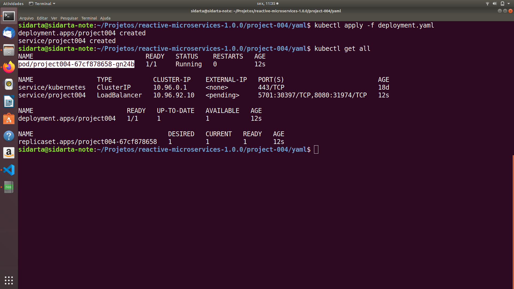
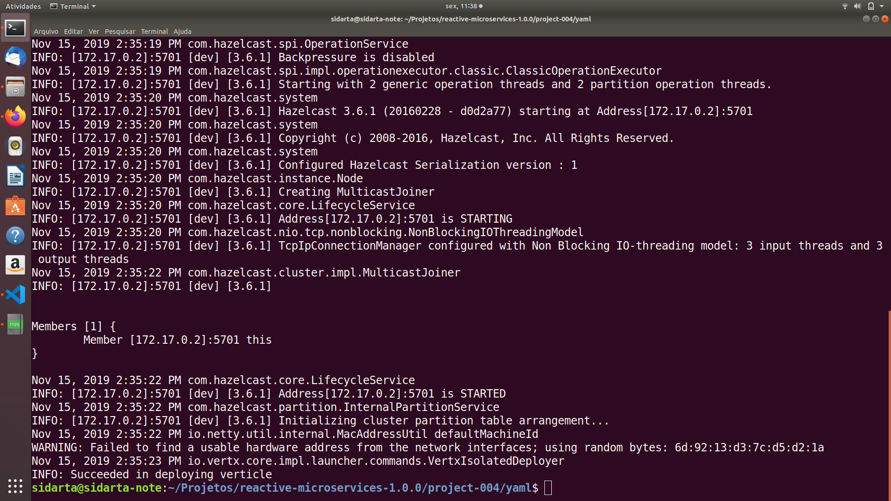

## Message-Based Microservices

### Project Creation

Let’s create a new project. This time we are going to add the Hazelcast dependency, an in-memory data grid that will be used to manage the cluster:

    mkdir project-004
    cd project-004

    mvn io.fabric8:vertx-maven-plugin:1.0.5:setup \
    -DprojectGroupId=io.vertx.sidartasilva.microservice \
    -DprojectArtifactId=project-004 \
      -Dverticle=io.vertx.sidartasilva.message.HelloMicroservice \
      -Ddependencies=hazelcast

Once generated, we may need to configure Hazelcast to build the cluster.

## Writing the Message-Driven Verticle

      public void start() {
          // Receive message from the address 'hello'
          vertx.eventBus().<String>consumer("hello", message -> {
              JsonObject json = new JsonObject()
                  .put("served-by", this.toString());
              // Check whether we have received a payload in the incoming message
              if (message.body().isEmpty()) {
                  message.reply(json.put("message", "hello"));
              } else {
                  message.reply(json.put("message", "hello " + message.body()));
              }
        });

This code retrieves the eventBus from the vertx object and registers a consumer on the address hello. When a message is received, it replies to it. Depending on whether or not the incoming message has an empty body, we compute a different response. As in the example in the previous chapter, we send a JSON object back. You may be wondering why we added the served-by entry in the JSON.

You’ll see why very soon. Now that the verticle is written, it’s time to launch it. 

      mvn compile vertx:run \ 
        -Dvertx.runArgs="-cluster" 

The -cluster tells Vert.x to start in cluster mode.

### Configuring Hazelcast for Kubernetes

On Kubernetes, Hazelcast should be configured to use the Hazelcast Kubernetes plugin.

      <dependency>
        <groupId>io.vertx</groupId>
        <artifactId>vertx-hazelcast</artifactId>
      </dependency>

      <dependency>
        <groupId>com.hazelcast</groupId>
        <artifactId>hazelcast-kubernetes</artifactId>
        <version>1.3.1</version>
      </dependency>
      
      <dependency>
        <groupId>com.hazelcast</groupId>
        <artifactId>hazelcast</artifactId>
        <version>3.6.1</version>
      </dependency>

### Grant access to Kubernetes API

In order for the Pod to use Kubernetes Api, we need to create the given Role Binding.

      kubectl apply -f rbac.yaml

### RBAC Yaml File 

    apiVersion: rbac.authorization.k8s.io/v1
    kind: ClusterRoleBinding
    metadata:
      name: default-cluster
    roleRef:
      apiGroup: rbac.authorization.k8s.io
      kind: ClusterRole
      name: view
    subjects:
    - kind: ServiceAccount
      name: default
      namespace: default

### Dockerfile

      FROM openjdk:8-jre-alpine
      ENV VERTICLE_FILE project-004-1.0-SNAPSHOT.jar
      ENV VERTICLE_HOME /usr/verticles
      ENV ENV_CLUSTER -cluster
      EXPOSE 8080
      EXPOSE 5701
      COPY $VERTICLE_FILE $VERTICLE_HOME/
      WORKDIR $VERTICLE_HOME
      ENTRYPOINT ["sh", "-c"]
      CMD ["exec java -jar $VERTICLE_FILE $ENV_CLUSTER"]

### Deploying to Kubernetes

Let's update deployment.yaml with the image we've pushed to Docker Hub. Then to deploy Hello Microservice application, we should run the following command.

      kubectl apply -f deployment.yaml

### Deployment Yaml File

    apiVersion: apps/v1
    kind: Deployment
    metadata:
      name: project004
    spec:
      replicas: 1 
      selector:
        matchLabels:
          app: project004
      template:
        metadata:
          labels:
            app: project004
        spec:
          containers:
            - name: project004
              image: sidartasilva/project004
              imagePullPolicy: Always
              ports:
              - containerPort: 5701
              - containerPort: 8080

    ---

    apiVersion: v1
    kind: Service
    metadata:
      name: project004
    spec:
      type: LoadBalancer
      selector:
        app: project004
      ports:
      - name: hazelcast
        port: 5701
      - name: app
        port: 8080

### Checking if the Hello Microservice is Up and Running

Now we're able to check if the Hello's Deployment, Pods and Service are up and running.

    kubectl get all

In the logs for Hello Microservice Pods, we're now able to see that the Hazelcast members formed a cluster.

      kubectl logs project004-67cf878658-gn24b

In the next project we'll be writing a microservice consuming this service.

