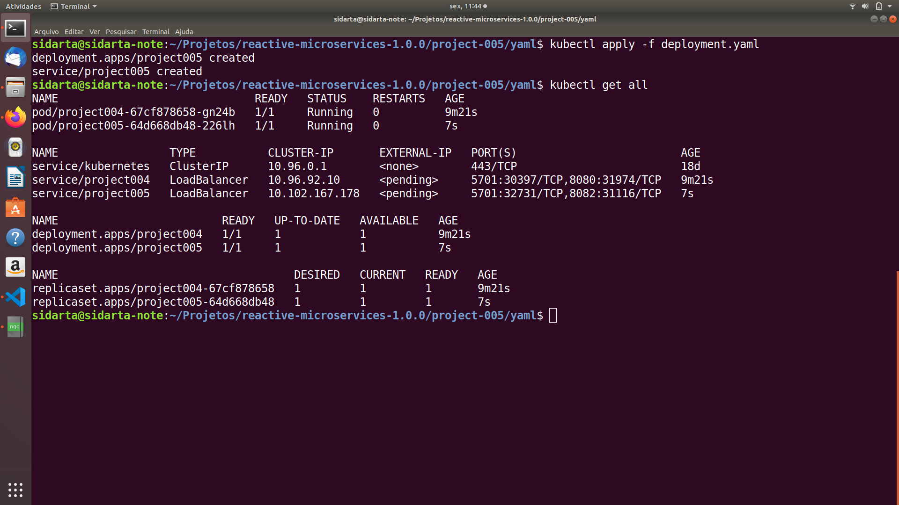
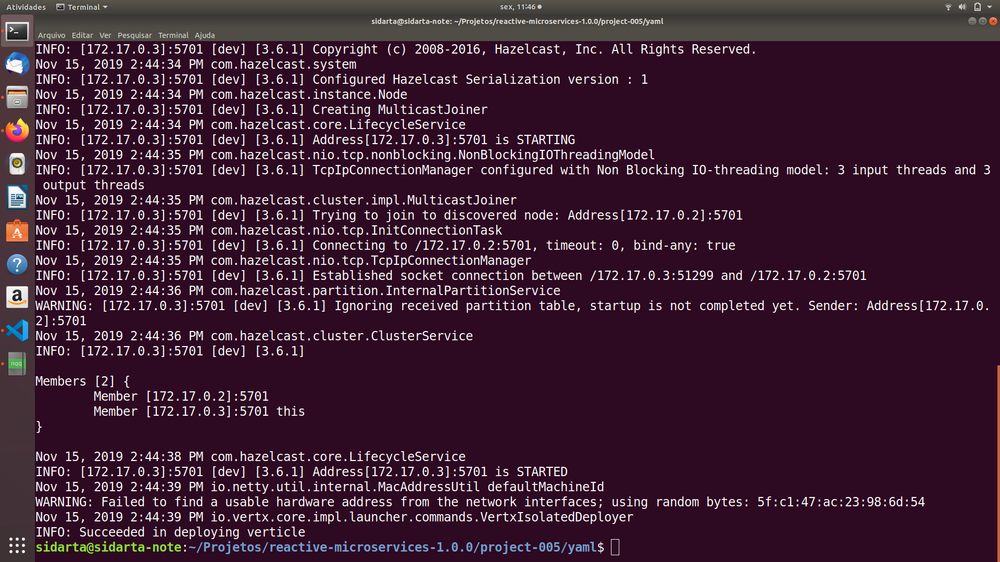
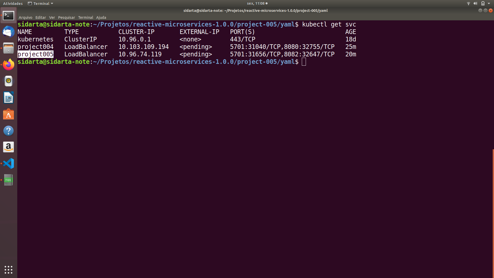
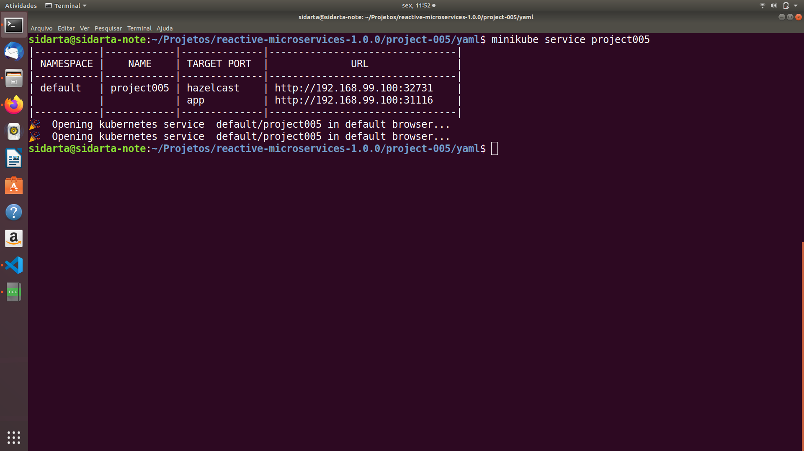
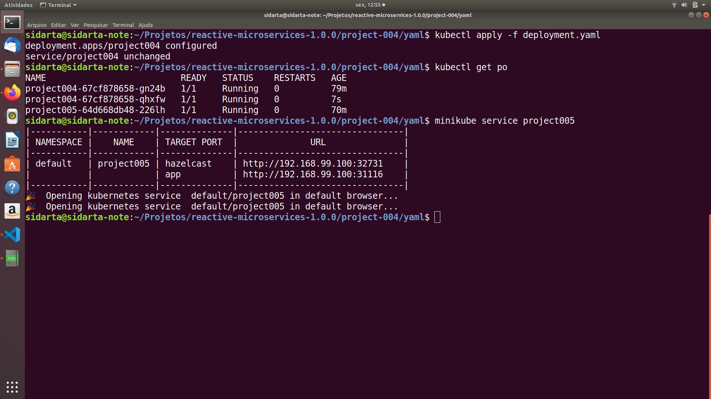
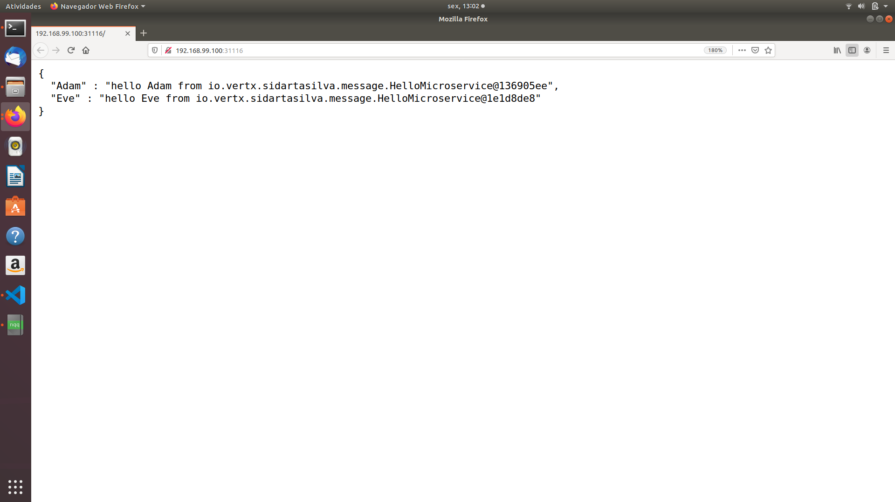
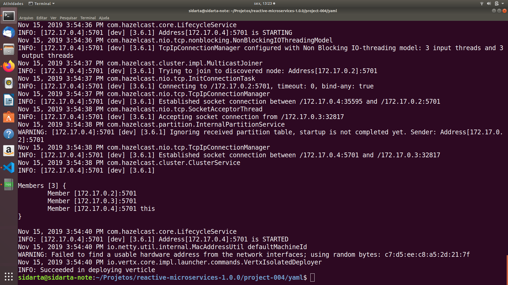

# Initiating Message-Based Interactions

In this section, we will create another microservice to invoke the hello microservice by sending a message to the hello address and get a reply.

The microservice will reimplement the same logic as in the previous chapter and  invoke the service twice: one to Adam and another one to Eve.

### Project Creation

      mkdir project-005
      cd project-005

      mvn io.fabric8:vertx-maven-plugin:1.0.5:setup \
      -DprojectGroupId=io.vertx.sidartasilva.microservice \
      -DprojectArtifactId=project-005 \
      -Dverticle=io.vertx.sidartasilva.message.HelloConsumerMicroservice \
      -Ddependencies=infinispan,rx

Now let's edit the io.vertx.sidartasilva.message.HelloConsumerMicroservice. Since we are going to use RxJava, we should change the import statement to match io.vertx.rxjava.core.AbstractVerticle. Then implement the start method with:

        @Override
        public void start() {
            EventBus bus = vertx.eventBus();
            Single<JsonObject> obs1 = bus
                .<JsonObject>rxSend("hello", "Adam")
                .map(Message::body);
            Single<JsonObject> obs2 = bus
                .<JsonObject>rxSend("hello", "Eve")
                .map(Message::body);

            Single
                .zip(obs1, obs2, (adam, eve) -> 
                    new JsonObject()
                        .put("Adam", adam.getString("message))
                        .put("Eve", eve.getString("message))
                )
                .subscribe(
                    x -> System.out.println(x.encode()),
                    Throwable::printStackTrace
                );
        }

This code is very similar to the code from the previous chapter. Instead of using a WebClient to invoke an Http endpoint, we will use the event bus to send a message to the hello address and extract the body of the reply.

We use the zip operation to retrieve the two responses and build the final result. In the subscribe method, we print the final result to the console or print the stack trace.

Let's combine this with an Http server. When an Http request is received, we invoke the hello service twice and return the built result as a response.

        @Override
        public void start() {
            vertx.createHttpServer()
                .requestHandler(
                    req -> {
                        EventBus bus = vertx.eventBus();
                        
                        Single<JsonObject> obs1 = bus
                            .<JsonObject>rxSend("hello", "Adam")
                            .map(Message::body);

                        Single<JsonObject> obs2 = bus
                            .<JsonObject>rxSend("hello", "Eve")
                            .map(Message::body);

                        Single
                            .zip(obs1, obs2, (adam, eve) -> 
                                new JsonObject()
                                    .put("Adam", adam.getString("message") + " from " + adam.getString("served-by"))
                                    .put("Eve", eve.getString("message") + " from " + eve.getString("served-by"))
                            )
                            .subscribe(
                                x -> req.response().end(x.encodePrettily()),
                                t -> {
                                  t.printStackTrace();
                                  req.response().setStatusCode(500).end(t.getMessage());
                                }
                            );
                    }
                )
                .listen(8082);
        }

The last code just wraps the event bus interactions into a requestHandler and deals with the Http response. In case of failure, we return a Json object containing an error message.

Now if we run this code with *mvn compile vertx:run -Dvertx.runArgs="-cluster"* and open the browser to http://localhost:8082, we should see something like:

      {
        "Adam" : "hello Adam from io.vertx.sidartasilva.message.HelloMicroservice@7e8fdd92",
        "Eve" : "hello Eve from io.vertx.sidartasilva.message.HelloMicroservice@7e8fdd92"
      }

### Deploying to Kubernetes

Let's update deployment.yaml with the image we've pushed to Docker Hub. Then to deploy the Hello microservice application, we should run the following command.

      kubectl apply -f deployment.yaml

### Deployment Yaml File

      apiVersion: apps/v1
      kind: Deployment
      metadata:
        name: project005
      spec:
        replicas: 1
        selector:
          matchLabels:
            app: project005
        template:
          metadata:
            labels:
              app: project005
          spec:
            containers:
              - name: project005
                image: sidartasilva/project005:latest
                imagePullPolicy: Always
                ports:
                - containerPort: 5701
                - containerPort: 8082

      ---
      apiVersion: v1
      kind: Service
      metadata:
        name: project005
      spec:
        type: LoadBalancer
        selector:
          app: project005
        ports:
        - name: hazelcast
          port: 5701
        - name: app
          port: 8082

### Checking if the Hello Consumer Microservice is Up and Running

Now we're able to check if the Hello Consumer's Deployment, Pods and Service were created and are up and running.

      kubectl get all

In the logs for Hello Consumer microservice Pod, we're now able to see that Hazelcast members formed a cluster.

      kubectl logs pod/project005-64d668db48-226lh

Now let's pick up the name for the service of Hello Consumer microservice.

    kubectl get svc

    

Then by running the following command:

      minikube service project005

The browser automatically opens up two tabs: one corresponding to hazelcast and the other one to our microservice application target port.

### Are We Reactive Now?

The code is very close to the HTTP-based microservice we wrote previously. The only difference is we used an event bus instead of HTTP. Does this change our reactiveness? It does! Let’s see why.

### Elasticity

Elasticity is one of the characteristics not enforced by the Http version of the microservice.

Because the microservice was targeting a specific instance of the microservice (using a hard-coded URL), it didn't provide de elasticiy we need.

But now that we are using messages sent to an address, this changes the game.

Let's see how this microservice system behaves.

Remember the output of the previous execution. The returned Json objects display the verticle having computed the hello message. The output always displays the same verticle. The message was indicating the same instance. We expect this because we had a single instance running. Now let's see what happens with two.

For that we should configure the deployment to have 2 Pod replicas of Hello microservice.

      apiVersion: apps/v1
      kind: Deployment
      metadata:
        name: project004
      spec:
        replicas: 2
        selector:
          matchLabels:
            app: project004
        template:
          metadata:
            labels:
              app: project004
          spec:
            containers:
              - name: project004
                image: sidartasilva/project004
                imagePullPolicy: Always
                ports:
                - containerPort: 5701
                - containerPort: 8080

This launches two instances for Hello microservice. 

Going back to the browser and refreshing the page we're able to see now that two instances of Hello are used. 

The Vert.x cluster connects the different nodes, and the event bus is clustered. Thanks to the event bus round-robin, the Vert.x event bus dispatches messages to the available instances and thus balances the load among the different nodes listening to the same address.

By adding in one more Pod, we're able to take notice of the inclusion of an additional node in the cluster.

      kubectl logs project004-67cf878658-qhxfw

So by using the event bus, we have the elasticity characteristic we need.

### Resilience

What about resilience? In the current code, if the hello microservice failed, we would get a failure and execute this code:

      t -> {
          t.printStackTrace();
          req.response().setStatusCode(500).end(t.getMessage());
      }

Even though the user gets an error message, we don't crash, we don't limit our scalability, and we can still handle requests. However, to improve the user experience, we should always reply in a timely fashion to the user, even if we don't receive the responses from the service. To implement this logic, we can enhance the code with a timeout.

